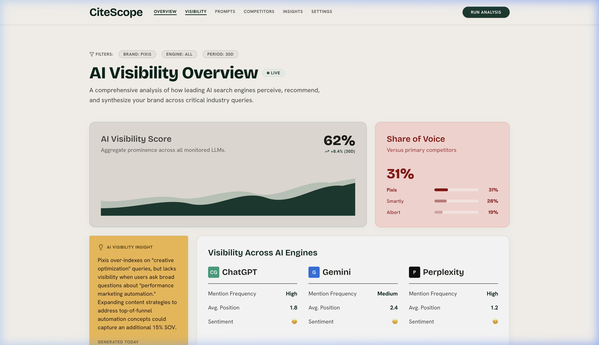
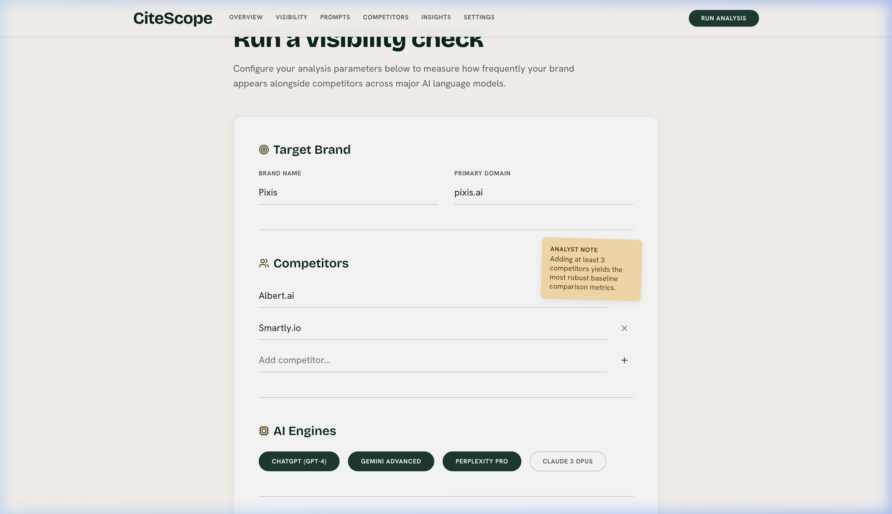
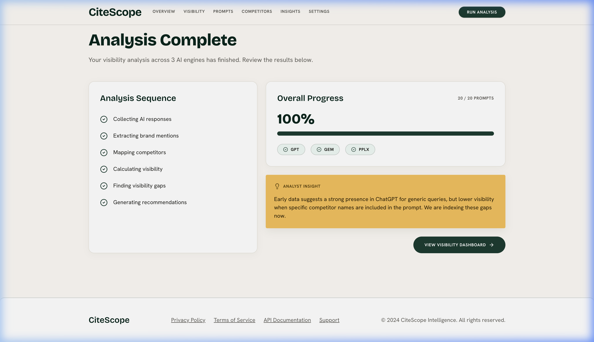
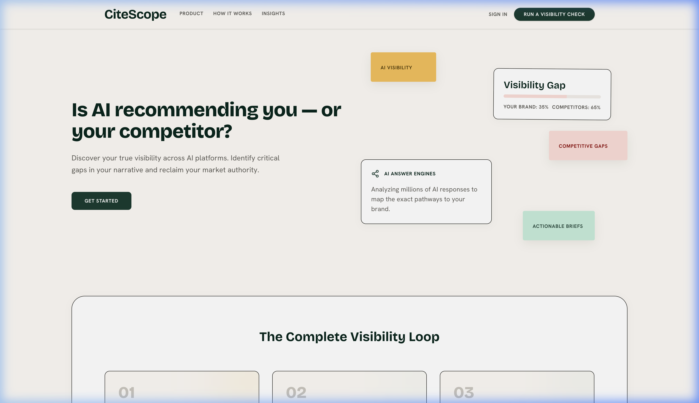

<div align="center">

# AI Brand Visibility Intelligence

### See what AI engines say about your brand.

Track how AI models mention your brand, compare against competitors, find visibility gaps, and get step-by-step content plans to win recommendations.

[](https://citescope-lime.vercel.app)
[](https://github.com/Praveenkanna16/ai-brand-visibility-intelligence)

<br/>


---



</div>

<br/>

## 💡 What is this?

**AI Brand Visibility Intelligence** measures how often AI answer engines (like Gemini, ChatGPT, Claude, and Perplexity) mention and recommend your brand when users ask questions in your industry.

It highlights where competitors are winning recommendations instead of you, and generates clear action briefs to help you win those AI recommendations back.

---

## 🎯 Why I built this

### The Problem
More and more people ask AI models for recommendations:
> *"What is the best AI advertising platform for enterprise businesses?"*

When this happens, companies have no idea:
- ❌ Is AI mentioning their brand?
- ❌ Which competitors are being recommended instead?
- ❌ Why the AI chose the competitor over them?

### The Solution
This project makes AI recommendations measurable and actionable.

```text
   User Question to AI
           │
           ▼
┌─────────────────────┐
│  AI Engine Answers  │  (Gemini, ChatGPT, Claude, Perplexity)
└──────────┬──────────┘
           │
           ▼
┌─────────────────────┐
│ Brand & Competitor  │  AI reads the response & detects all mentioned brands
│      Detection      │
└──────────┬──────────┘
           │
           ▼
┌─────────────────────┐
│ Visibility Scoring  │  Calculates Visibility Score, Mention Rate & Rank
└──────────┬──────────┘
           │
           ▼
┌─────────────────────┐
│  Strategic Briefs   │  Generates exact step-by-step content plans to fix gaps
└─────────────────────┘
```

---

## ⚡ Big Product Workflow

```text
  [ User Configures Brand & Competitors ]
                     │
                     ▼
       [ Prompt Execution Engine ]
      ├── Gemini 2.5 Flash / Pro
      ├── OpenAI GPT-4o
      ├── Anthropic Claude 3.5
      └── Perplexity Pro
                     │
                     ▼
         [ Extractor Agent (AI) ]
   Extracts: Mention Status | Rank (1st, 2nd) | Competitors | Sentiment
                     │
                     ▼
          [ Scoring Calculator ]
   Calculates: Visibility Score % | Mention Rate | Avg Rank | Voice Share
                     │
                     ▼
      [ Recommendation Brief Agent ]
   Generates: Strategic Gap Analysis & Actionable Content Briefs
```

---

## 📊 What It Measures

| Metric | Simple Explanation | What High Means |
| :--- | :--- | :--- |
| **Visibility Score** | Percentage of AI queries where your brand is mentioned. | AI almost always includes your brand in answers. |
| **Mention Rate** | How frequently your brand appears across all tested AI engines. | Strong presence across all major AI models. |
| **Average Rank** | Position of your brand when listed (e.g. 1st, 2nd, 3rd). | AI ranks your brand at the top of recommendations. |
| **Share of Mentions** | Your share of mentions compared to all named competitors. | You dominate the conversation over competitors. |
| **Per-Engine Frequency** | Breakdown of performance on Gemini vs Claude vs OpenAI. | Shows which specific AI engines favor your brand. |

---

## 📱 Product Walkthrough

### 1. Visibility Intelligence Dashboard
Track your brand's overall visibility score, average recommendation rank, competitor market share, and per-engine breakdown in real time.


---

### 2. New Analysis Configuration
Run customizable visibility checks by selecting target brands, competitor lists, active AI engines, and industry queries.



---

### 3. Automated Execution & Live Progress
Watch real-time query execution across configured AI engines with live progress tracking and status indicators.



---

### 4. Interactive Landing Experience
Sleek dark-mode aesthetic with interactive Bento grid feature showcases and animated insights preview.



---

## 🏗️ Architecture

```text
┌─────────────────────────────────────────────────────────┐
│                    Next.js 16 App                       │
│      React 19 Components • Tailwind CSS v4 • Framer     │
└────────────┬───────────────────────────────┬────────────┘
             │                               │
             ▼                               ▼
┌─────────────────────────┐     ┌─────────────────────────┐
│   REST API Route Layer  │     │   Server Action Layer   │
│ /api/runs  /api/insights│     │  Interactive Triggering │
└────────────┬────────────┘     └────────────┬────────────┘
             │                               │
             └───────────────┬───────────────┘
                             │
                             ▼
 ┌──────────────────────────────────────────────────────┐
 │                     AI Engine Pipeline               │
 ├───────────────────┬──────────────────┬───────────────┤
 │ Gemini Provider   │ OpenAI Provider  │ Claude        │
 ├───────────────────┴──────────────────┴───────────────┤
 │ 1. Extractor Agent (Structured JSON Parsing)         │
 │ 2. Scoring Engine (Statistical Aggregation)          │
 │ 3. Recommendation Brief Agent (Gap Analysis)        │
 └───────────────────────────┬──────────────────────────┘
                             │
                             ▼
 ┌──────────────────────────────────────────────────────┐
 │                    Prisma 7 ORM                      │
 │     SQLite (Local Dev) / PostgreSQL (Production)     │
 └──────────────────────────────────────────────────────┘
```

---

## 🤖 AI Pipeline Explained

1. **Multi-Engine Prompt Runner**: Dispatches target industry queries to multiple AI model APIs concurrently.
2. **Semantic Extractor Agent**: Uses structured JSON schemas (`ExtractorAgent`) to scan raw text and extract exact brand mentions, ranking order, competitor mentions, and sentiment.
3. **Scoring Calculator Engine**: Pure functional score calculator (`ScoringCalculator`) computing overall Visibility %, Average Rank, Share of Voice, and per-engine breakdowns.
4. **Actionable Brief Generator**: When a competitor wins a recommendation over your brand, the `RecommendationAgent` performs a deep gap analysis and produces a downloadable content strategy brief.

---

## 🛠️ Tech Stack

| Layer | Technology | Reason Chosen |
| :--- | :--- | :--- |
| **Framework** | Next.js 16 (App Router + Turbopack) | Fast page loads, server components, and API routes. |
| **Language** | TypeScript (Strict Mode) | Type-safe data pipeline from AI API to UI components. |
| **Styling** | Tailwind CSS v4 + Framer Motion | High-performance CSS engine with smooth visual micro-animations. |
| **AI SDK** | `@google/generative-ai` & multi-provider factory | Native support for Gemini 2.5 Flash / Pro and fallbacks. |
| **Database** | Prisma 7 ORM + SQLite / PostgreSQL | Type-safe database queries and migrations. |
| **Testing** | Vitest | Lightning fast unit testing for scoring logic and providers. |

---

## 💡 Key Engineering Decisions

- **Hybrid AI & Rule Extraction**: Extractor falls back to fast deterministic regex string matching if an API key is missing or encounters rate limits, guaranteeing zero runtime crashes.
- **Provider Pattern Architecture**: AI engines are wrapped in a unified interface (`LLMProviderBase`), making it trivial to plug in additional LLM models.
- **Zero-Config Demo Mode**: Includes full mock data seeds (`DEMO_MODE=true`) allowing full platform evaluation without requiring live API keys.
- **Pure Functional Scoring Engine**: Keeps analytical score calculations isolated from UI rendering and database access, backed by Vitest unit tests.

---

## 📋 Example Strategic Brief Output

When CiteScope detects a visibility gap, it generates structured strategic recommendations:

```json
{
  "observation": "Competitor (Albert.ai) monopolized the primary recommendation slot for enterprise queries.",
  "whyCompetitorWon": "Albert.ai established authoritative semantic links around automated cross-channel optimization.",
  "hypothesis": "Publishing comparative enterprise deployment whitepapers will displace competitor recommendations.",
  "recommendedAction": "Create a comprehensive technical whitepaper and comparison guide on AI Ad Performance.",
  "contentType": "Comparison Guide / Whitepaper",
  "contentAngle": "Technical deep-dive on predictive scaling and enterprise deployment timelines",
  "suggestedEvidence": "Customer case studies demonstrating >20% ROAS improvement",
  "confidence": 0.88
}
```

---

## 🚀 Getting Started

### Prerequisites

- Node.js 18+ installed
- npm or pnpm package manager

### Environment Variables

Copy `.env.example` to `.env`:

```bash
cp .env.example .env
```

```env
# Set DEMO_MODE to "false" when using live AI keys
DEMO_MODE=true

# Database Connection (SQLite default for local dev)
DATABASE_URL="file:./dev.db"

# AI Provider Keys
GEMINI_API_KEY="your_gemini_api_key"
OPENAI_API_KEY="your_openai_api_key"
ANTHROPIC_API_KEY="your_anthropic_api_key"

# App URL
NEXT_PUBLIC_APP_URL="http://localhost:3000"
```

### Installation & Local Run

1. **Install dependencies**:
   ```bash
   npm install
   ```

2. **Generate Database Schema**:
   ```bash
   npx prisma db push
   ```

3. **Run Development Server**:
   ```bash
   npm run dev
   ```

4. **Open Browser**:
   Navigate to [http://localhost:3000](http://localhost:3000).

---

## 🧪 Testing

Run unit tests for scoring logic and AI provider handlers:

```bash
npm run test
```

---

## 📁 Project Structure

```text
citescope/
├── prisma/
│   └── schema.prisma          # Database models (Brand, Run, Result, Insight, Brief)
├── public/
│   └── screenshots/           # Application screenshots for README & docs
├── src/
│   ├── app/                   # Next.js App Router routes & API endpoints
│   │   ├── api/               # REST API endpoints (runs, insights, prompts)
│   │   ├── dashboard/         # Brand visibility dashboard
│   │   ├── insights/          # Detailed insight & strategic brief pages
│   │   ├── prompts/           # Tracked prompts configuration
│   │   ├── runs/              # New analysis runner & execution progress
│   │   └── trends/            # Historical visibility trends
│   ├── components/            # UI components, cards, navbar & layout
│   └── lib/
│       ├── ai/                # Multi-provider LLM factory (Gemini, Claude, OpenAI)
│       ├── extraction/        # ExtractorAgent structured JSON parser
│       ├── recommendations/   # RecommendationAgent brief generator
│       ├── scoring/           # ScoringCalculator metric engine
│       └── prisma/            # Prisma client singleton
└── vitest.config.ts           # Vitest configuration
```

---

## 🔮 Future Improvements

- [ ] **Live Web Crawler Verification**: Verify cited URLs in AI answers for backlink checking.
- [ ] **Automated Scheduled Checks**: Run daily visibility audits using background cron jobs.
- [ ] **Exportable PDF Reports**: Generate executive-ready PDF briefs for marketing teams.

---

## 👤 Author

**Praveen Kanna K R**

- GitHub: [@Praveenkanna16](https://github.com/Praveenkanna16)
- Live Platform: [CiteScope Web App](https://citescope-lime.vercel.app)
